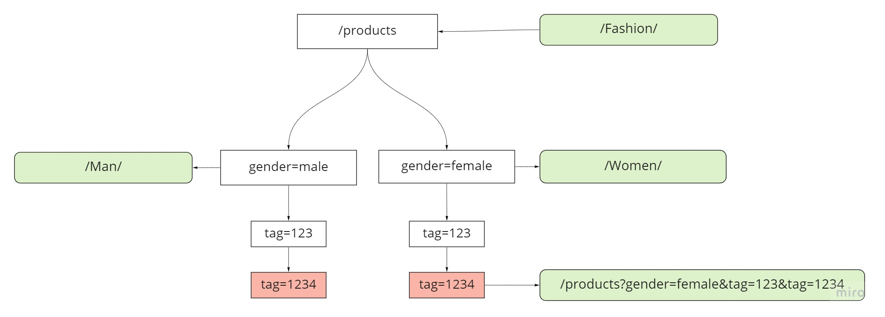

#### Preamble:

A better solution will be to redesign the system, so URL could describe itself without the need to hold URLs mapping.

If look from the requirements perspective, Neo4j would ideally fit this task.

But I'm assuming that you're expecting in-memory solution with the custom data structure.

### Requirements

* java 11

### Used:

* Gradle
* Spring boot
* ehcache

## How to:

### Run application

#### Prerequisites:

Make sure that gradlew executable:

#### Command for Mac/nix:

``chmod +x gradlew``

### 1. Run Application without build

Command:

```shell
gradlew bootRun
```

### 2. Build application with tests

```shell
gradlew clean build
```

### 3. Run only tests

```shell
gradlew clean test 
```

### 5. Reports:

* Test results:

> build/reports/tests/test/index.html

* Test coverage report:

> build/reports/jacoco/test/html/index.html

### 6. Run application in docker container

#### Required:

* Docker

#### Build application container image:

* Build application (without tests):

```shell
gradlew clean build -x test
```

* Build image:

```shell
docker build -t seo-url-app .
```

#### Start application container:

```shell
docker run -dp 8080:8080 seo-url-app .
```

Watch logs:

```shell
docker logs <CONTAINER_ID> -f
```

* where <CONTAINER_ID> - container ID from the previous command

## Design

According to requirements assuming that data should be loaded in memory. The best solution for partial search will be Tree.

1. Load All URL mapping in memory
1. Build trees for key and value

1. To do that we have to split url to a parts
   - Query separator is the best to match for this.
   ```
   
   Initial url:    /products?gender=female&tag=123
     
   Tree build from initial url:
   
   products
     |
   gender=female
     |
   tag=123
     |
   tag=1234 - > /Women/Shoes/ 

   ```
1. Last node will hold mapped url.
1. For partial URL search will hold last node with URL.
   1. if no such node return original URL
   1. otherwise, build a new URL from the last node + rest part of URL
   1. check URL coverage

   - if it less than configured threshold return original URL
   - otherwise, return the built URL



Complexity is: **O(n)** where **n** is number of URL parts

Memory: **O(n * 2 + m)** -> **O(n+m)** where **n** number of urls and **m** number of nodes

#### Memory calculation:

> Max url length: 2048

Assuming 1 ULR length 1024 chars * 2 bytes per char = 2Kb

We have to store 2 links for bidirectional mapping
> 2Kb per link * 2 = 4Kb

> 4Kb * 1,000,000 = 4Gb

> Plus memory needed for storing url parts 1Gb

Minimum memory requirements for holding 1M URLs will be 5Gb

### Caching:

To improve performance, we can use caching.

#### Shared cache:

Redis is a good solution.

**pros:**

* no extra memory needed on the url-service instances

**cons:**

* Increase infrastructure overheads
* Bit Lower performance because of network latency

#### Local cache:

**pros:**

* No network lags

**cons:**

* Using cache (store all 1M records) will need an extra 4Gb to store search results.

The total amount of memory needed: 9Gb per instance.

#### Test data:

Code includes 50K Generated URL pairs.
