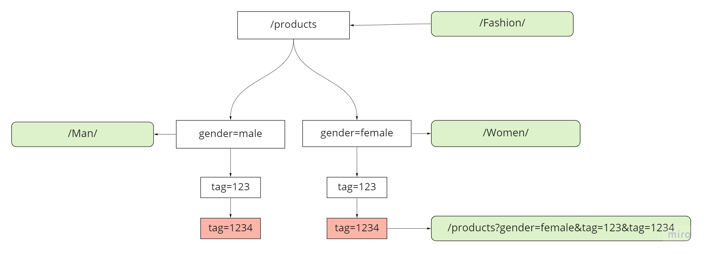

### Requirements

* java 11

## How to:

### Run application

#### Prerequisites:

Make sure that gradlew executable:

#### Command for Mac/nix:

``chmod +x gradlew``

### 1. Run Application without build

Command:

```shell
gradlew bootRun
```

### 2. Run application in docker container

#### Prerequisites:

Make sure that Docker is installed.

#### Build application container image:

```shell
docker build -t seo-url-app .
```

#### Start application container:

```
docker run -dp 8080:8080 seo-url-app .
```

### 3. Run tests

```shell
gradlew clean test 
```

##### Reports:

* Test results:

> build/reports/tests/test/index.html

* Test coverage report:

> build/reports/jacoco/test/html/jacoco-sessions.html

## Design

According to requirements assuming that data should be loaded in memory. The best solution for partial search will be Tree.

1. Load All url mapping in memory
1. Build trees for key and value

1. To do that we have to split url to a parts
   - Query separator is the best to match for this
   ```
   
   Initial url:    /products?gender=female&tag=123
     
   Tree build from initial url:
   
   products
     |
   gender
     |
   gender=female
     |
   tag=123
     |
   tag=1234 - > /Women/Shoes/ 

   ```
1. Last node will hold mapped url



Complexity is: **O(n)** where **n** is number of URL parts

Memory: **O(n * 2 + m)** -> **O(n+m)** where **n** number of urls and **m** number of nodes

#### Memory calculation:

> Max url length: 2048

Assuming 1 ULR length 1024 chars * 2 bytes per char = 2Kb

We have to store 2 links for bidirectional mapping
> 2Kb per link * 2 = 4Kb

> 4Kb * 1,000,000 = 4Gb

> Plus memory needed for storing url parts 1Gb

Minimum memory requirements for holding 1M URLs will be 5Gb

### Caching:

To improve performance we can use caching

For using cache (store all 1M records) will be needed extra 4Gb to store search results.


